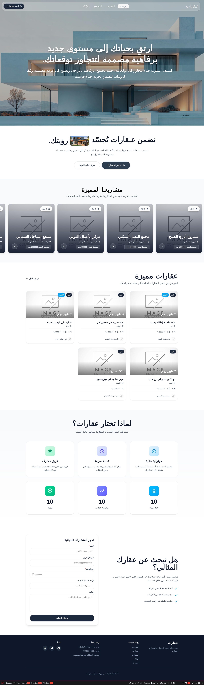
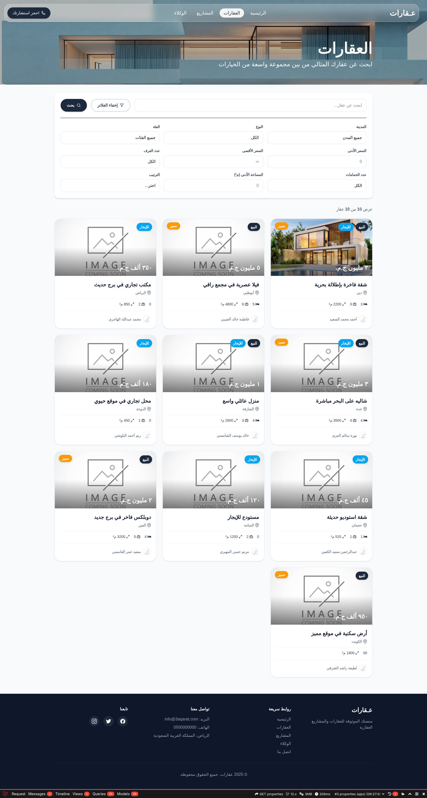
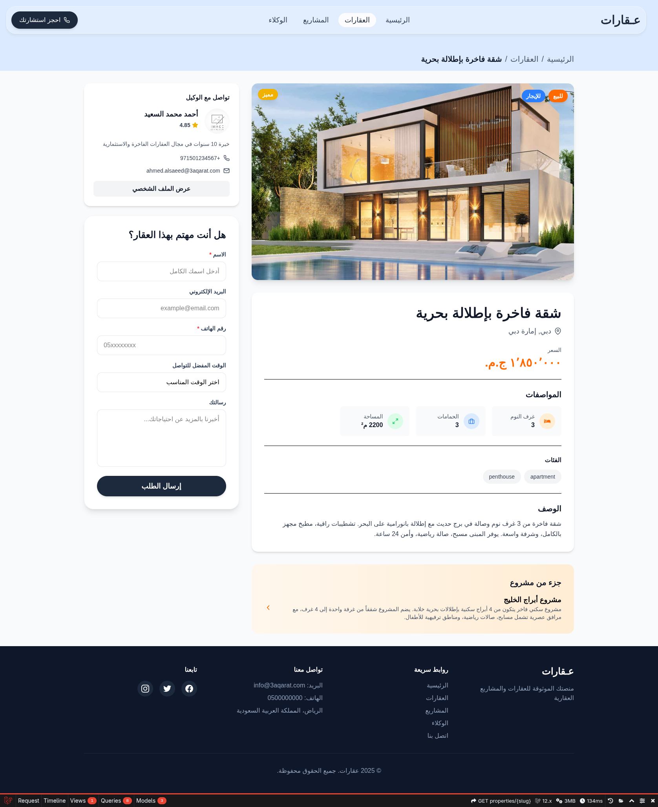
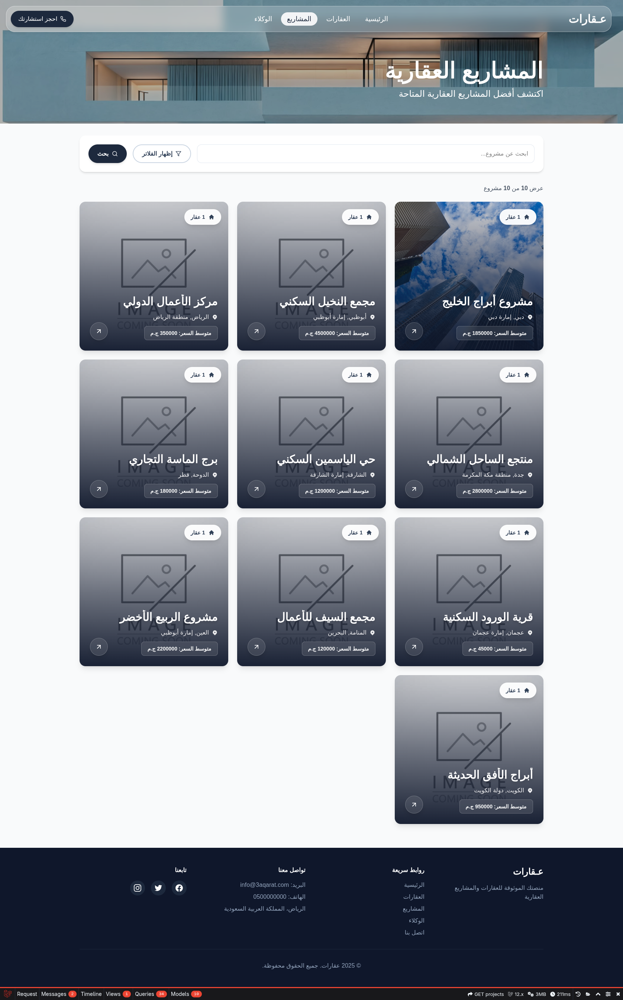
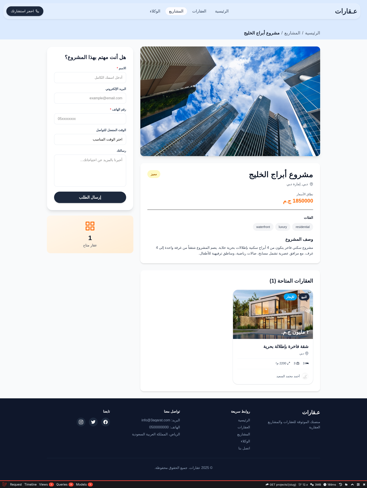
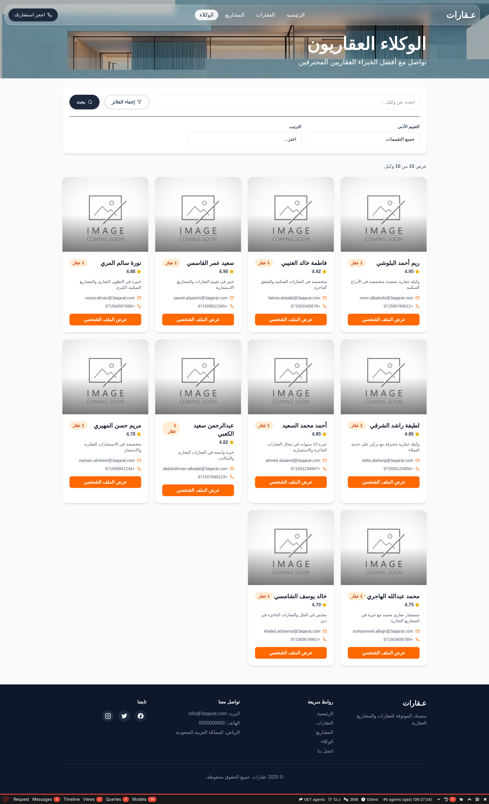
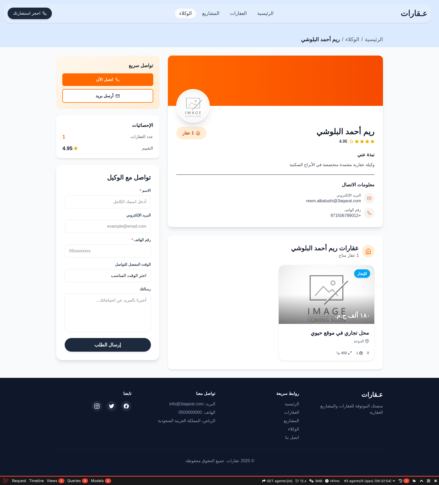
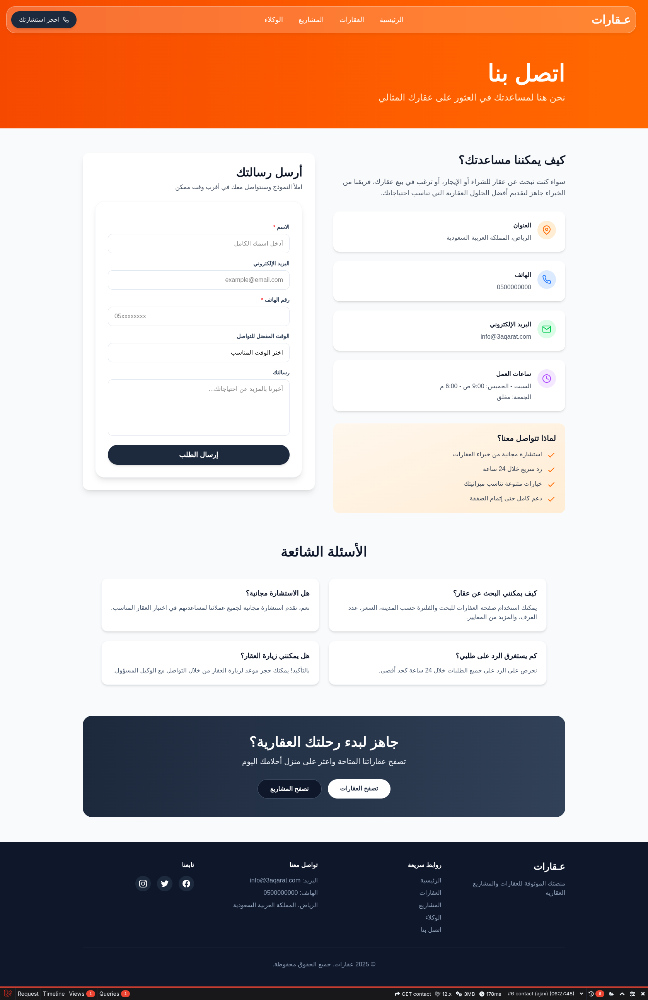
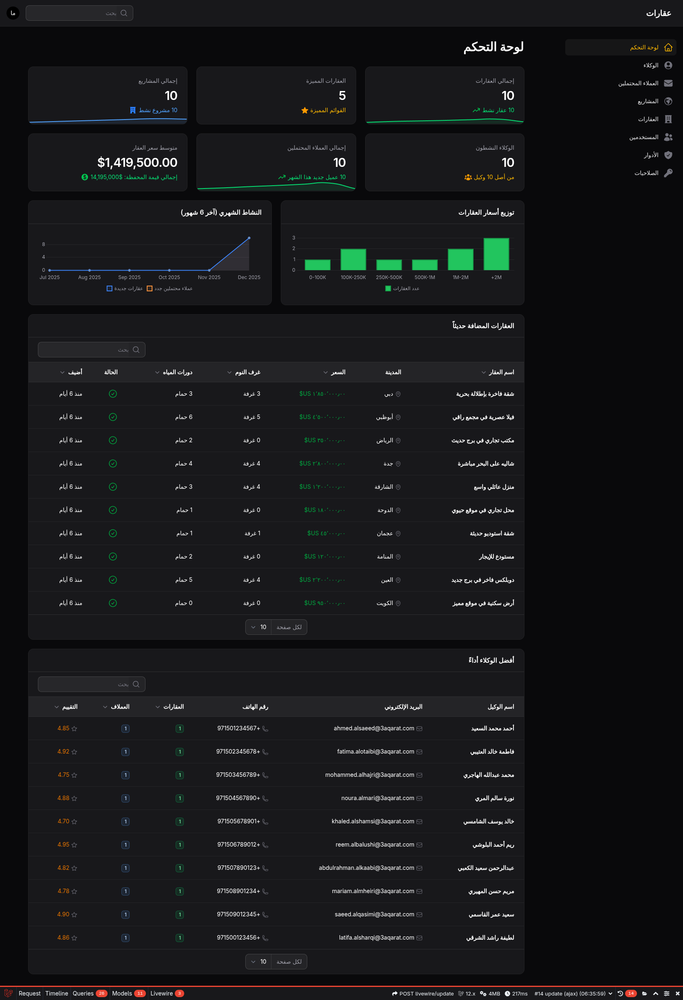

# 🏡 3aqarat - Real Estate Management Platform


## 📋 Project Overview

3aqarat is a comprehensive real estate management platform designed to streamline property listings, lead management, and agent operations. Built with modern technologies to provide a robust and scalable solution for real estate businesses.

## 🎨 Design Inspiration

Partially inspired by: [Real Estate Website Design on Dribbble](https://dribbble.com/shots/25373479-Real-Estate-Website)

## 📸 Screenshots

<div align="center">
  
  
</div>

<div align="center">
  
  
</div>

<div align="center">
  
  
</div>

<div align="center">
  
  
</div>

<div align="center">
  
</div>

## 🛠️ Tech Stack

### Backend
- **Laravel 12** - PHP framework for robust backend architecture
- **Filament 4** - Modern admin panel and resource management
- **Spatie Laravel Permission** - Role and permission management
- **SQLite** - Primary database

### Frontend
- **Inertia.js** - Modern monolith architecture
- **React 18** - UI component library
- **Vite** - Fast build tool and development server
- **Tailwind CSS** - Utility-first CSS framework

### Development Tools
- **Laravel Debugbar** - Development debugging
- **PHPUnit** - Testing framework
- **Composer** - PHP dependency management
- **NPM** - JavaScript package management

## 📦 Core Models

- **Agent** - Real estate agent management
- **Project** - Property development projects
- **Property** - Individual property listings
- **Lead** - Customer lead tracking
- **User** - System user authentication and authorization

## 🚀 Getting Started

### Prerequisites
- PHP 8.2 or higher
- Composer
- Node.js 18+ and NPM
- SQLite

### Installation

```bash
# Clone the repository
git clone https://github.com/kareem-codes/3aqarat.git
cd 3aqarat

# Install PHP dependencies
composer install

# Install JavaScript dependencies
npm install

# Copy environment file
cp .env.example .env

# Generate application key
php artisan key:generate

# Configure your database in .env file
# Then run migrations
php artisan migrate

# Seed roles and permissions
php artisan db:seed

# Build frontend assets
npm run build

# Start development server
php artisan serve
```

### Development Mode

```bash
# Run Vite dev server
npm run dev

# In another terminal, run Laravel
php artisan serve
```

## 📝 Features

- ✅ User authentication and authorization
- ✅ Agent management system
- ✅ Property listings and management
- ✅ Project tracking and oversight
- ✅ Role-based access control
- ✅ Admin dashboard with Filament
- ✅ Lead capture and management
- ✅ Responsive UI with React components
